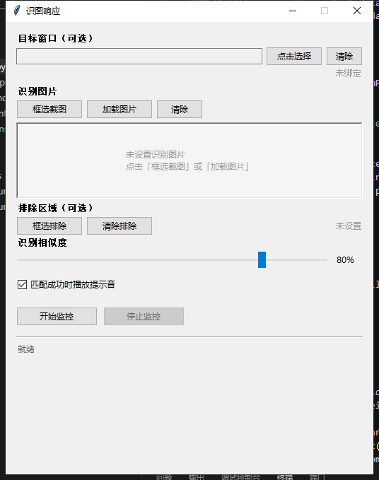

# 识图响应 (Image Recognition Responder)

通过图像识别技术自动检测屏幕指定区域，当匹配到预设图片时自动触发响应（播放提示音）。



## 功能特性

- **框选截图** - 直接在屏幕上框选目标区域作为识别模板
- **加载图片** - 从本地加载已有图片作为识别模板
- **窗口绑定** - 可选绑定到特定窗口，仅监控该窗口区域
- **排除区域** - 可框选屏幕上的特定区域，识别时自动忽略该区域（支持多个排除区域）
- **相似度调节** - 可调节匹配灵敏度（0-100%）
- **提示音反馈** - 匹配成功时播放提示音
- **配置保存** - 自动保存配置、模板图片和排除区域，下次启动自动恢复

## 使用方法

1. 运行 `识图响应.exe`
2. 点击「框选截图」或「加载图片」设置识别目标
3. （可选）点击「点击选择」绑定目标窗口
4. （可选）点击「框选排除」选择不需要识别的区域（如界面上的固定图标、按钮等）
5. 调节相似度阈值
6. 点击「开始监控」开始自动识别
7. 匹配成功时播放提示音并在界面显示状态

> **排除区域技巧**：当屏幕上有固定不动的元素（如任务栏、程序固定按钮等）可能干扰识别时，可使用「框选排除」功能将它们排除，提高识别准确性。支持多次框选添加多个排除区域。

## 技术栈

- Python 3.13
- OpenCV (模板匹配)
- Pillow (图像处理)
- tkinter (GUI)
- PyInstaller (打包)

## 开发环境

```bash
pip install -r requirements.txt
python 识图响应.py
```

## 打包

```bash
pyinstaller 识图响应.spec
```
